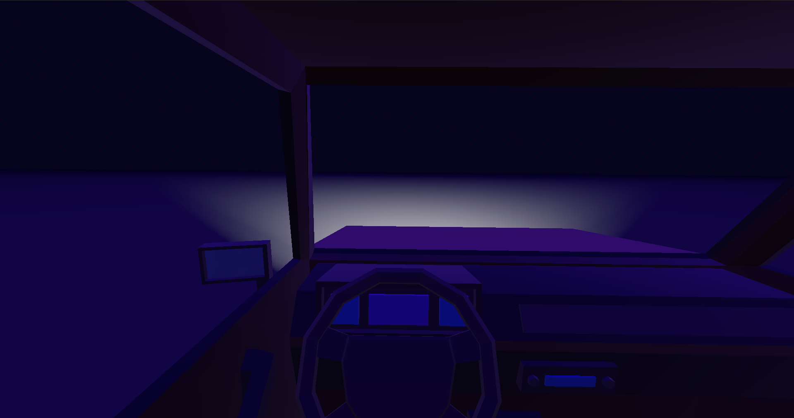
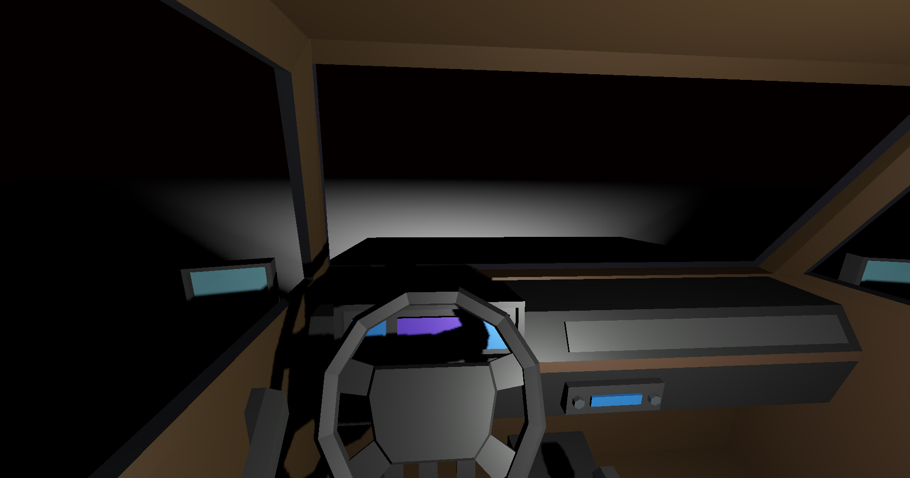
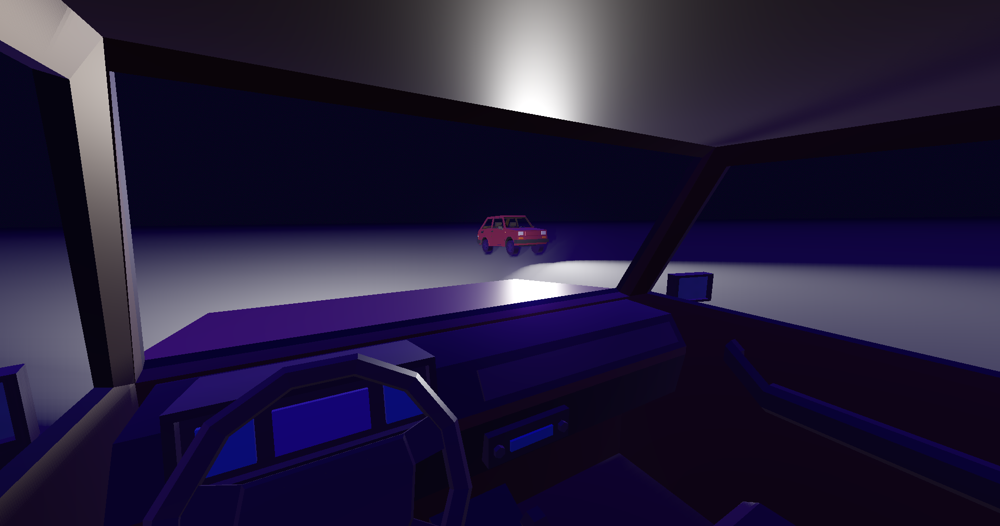

# Solipsism





This is an experience driving game inspired by [Yugo](https://petrithxha.itch.io/yugo)

In this game you will drive a car in a low-poly world and also be able to play your songs from inside the car radio to increase the immersion while you drive across many places of the world.

You will also be able to play with your friends and listen their songs from distance.

## Controls

- Arrow Keys/WASD - Move the player
- Z - Control the external car lights
- X - Control the internal car lights
- Space - Play/Pause music

## Goals

- [x] Add a car
- [x] Add first person camera
- [x] Add car lights
- [x] Add 3D sound on car speakers
- [ ] Add a low-poly world with roads
- [ ] Add day and night cycle
- [ ] Add weather
- [ ] Add music playback from the user files
- [ ] Add a way to play YouTube, Deezer and Spotify music
- [x] Add LAN multiplayer
- [ ] Add dedicated server multiplayer

## Chat

- [Discord](https://discord.gg/d9ca4U64H4)
- [Matrix](https://matrix.to/#/#foss-supremacy:matrix.org)

## Bugs

If you want to send a bug report, open an issue with "(Bug)" before the title.

## Requests and Suggestions

### Features

If you have a feature request, open an issue with "(Feature request)" before the title.

### Suggestion

If you have a suggestion, open an issue with "(Suggestion)" before the title.

## How to Clone and Build

- Download the repository and game assets

```sh
git clone https://github.com/FOSS-Supremacy/crawling-agony
```

- Download the [Godot Engine](https://godotengine.org/) 4.x version (normal variant, not C#)
- Export the executable to your operating system

## How To Contribute

- Give a star to this repository, it will increase our chances to receive contributions.
- Download the [Godot Engine](https://godotengine.org/) 4.x version (normal variant, not C#)
- Verify the open issues and select some item to work on
- Once ready, send a pull request (if you are adding commits on the PR branch, mark it as draft status)
- Send the link of your pull requests on the "Pull Requests" channel/room on [Discord](https://discord.gg/tk6Vnxv9Qt) or [Matrix](https://matrix.to/#/!vIwqjDewTZpciZqhEp:matrix.org?via=matrix.org).
- We don't accept C# code

## Blender

You can download the Blender project of the game on [this](https://drive.google.com/drive/folders/1jZBCqkpzXVJBxL5ivKAEt7b-HUksD-1X?usp=drive_link) link.

## Donate

If you want to support our work, consider a donation, every amount is important.

- [Patreon](https://www.patreon.com/foss_supremacy)
- [Bitcoin](https://bitcoin.org)

```
bc1qg9x5vzr4ppkm2ssw5k7ete4lu49wg7t02azkce
```

## Credits

- [Car](https://www.cgtrader.com/free-3d-models/car/car/low-poly-micro-car-80s-fiat-126p)
